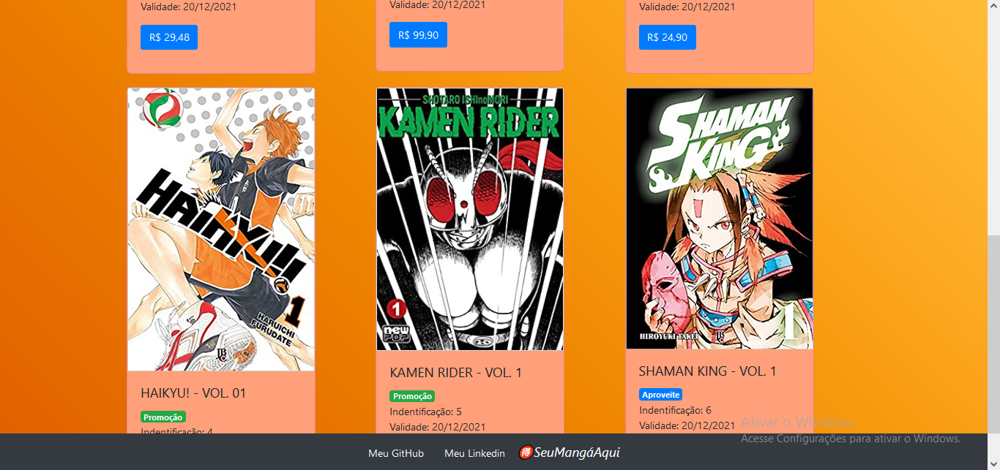
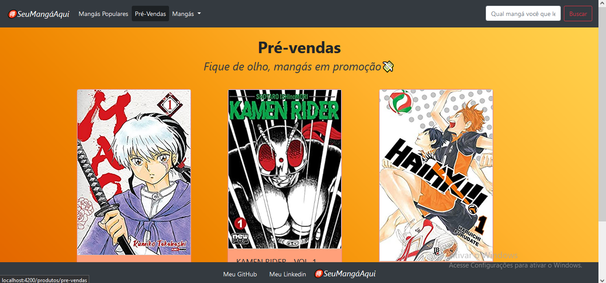

# <i>🉐SeuMangáAqui</i>

 Projeto CRUD - Loja de Mangás <i>🉐SeuMangáAqui</i>

 PWEBII - <i>💻 Programação WEB II
</i>

 Feito por <i>Carlos Kauan Costa de Brito</i>

 <i>Framework</i> 

 

## <i>🕹️Executar</i>

<code>ng serve -o</code> para executar :) 

## <i>🏠Tela Principal</i> 

  
  

 

## <i>🛍️Tela de Pré-vendas</i>

  

